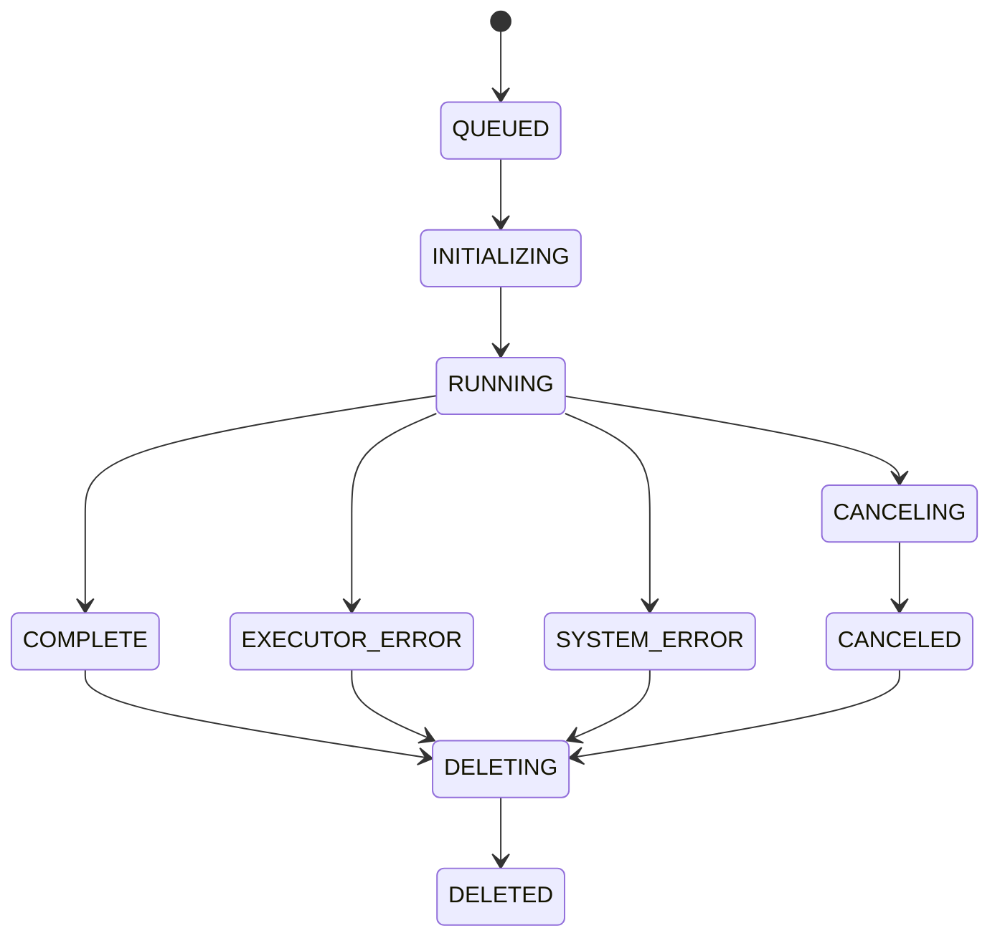

# API Specification

## OpenAPI Definition

The sapporo-service implements the [GA4GH WES 1.1.0](https://github.com/ga4gh/workflow-execution-service-schemas) specification and builds on it with additional endpoints defined in the sapporo-wes-2.0.0 extension.

For the full OpenAPI definition, see [`sapporo-wes-spec-2.0.0.yml`](https://github.com/sapporo-wes/sapporo-service/blob/main/sapporo-wes-spec-2.0.0.yml) or browse it in [SwaggerUI](https://petstore.swagger.io/?url=https://raw.githubusercontent.com/sapporo-wes/sapporo-service/main/sapporo-wes-spec-2.0.0.yml).

When the service is running, access `http://localhost:1122/docs` to explore the API and execute requests interactively.

## Endpoints

### GA4GH WES 1.1.0

| Endpoint | Method | Description |
|---|---|---|
| `/service-info` | GET | Get service information |
| `/runs` | GET | List workflow runs |
| `/runs` | POST | Submit a workflow run |
| `/runs/{run_id}` | GET | Get run details |
| `/runs/{run_id}/status` | GET | Get run status |
| `/runs/{run_id}/cancel` | POST | Cancel a run |

### sapporo-wes-2.0.0 Extensions

| Endpoint | Method | Description |
|---|---|---|
| `/runs/{run_id}` | DELETE | Delete a run |
| `/executable-workflows` | GET | List executable workflows |
| `/runs/{run_id}/outputs` | GET | List/download output files |
| `/runs/{run_id}/outputs/{path}` | GET | Download a specific output file |
| `/runs/{run_id}/ro-crate` | GET | Get RO-Crate metadata |
| `/token` | POST | Issue JWT token (sapporo auth mode) |
| `/me` | GET | Get authenticated user info |

## Run States

| State | Description |
|---|---|
| `QUEUED` | Queued for execution |
| `INITIALIZING` | Preparing execution environment |
| `RUNNING` | Workflow is executing |
| `PAUSED` | Execution paused |
| `COMPLETE` | Completed successfully |
| `EXECUTOR_ERROR` | Workflow engine error |
| `SYSTEM_ERROR` | System-level error |
| `CANCELED` | Canceled by user |
| `CANCELING` | Cancellation in progress |
| `DELETED` | Deleted (sapporo extension) |
| `DELETING` | Deletion in progress (sapporo extension) |

### State Transitions



Normal flow: `QUEUED` -> `INITIALIZING` -> `RUNNING` -> `COMPLETE`

Error paths:

- Workflow engine failure -> `EXECUTOR_ERROR`
- System-level failure (signal, unexpected error) -> `SYSTEM_ERROR`
- User cancellation -> `CANCELING` -> `CANCELED`
- Run deletion -> `DELETING` -> `DELETED`

## Request and Response Examples

### Submit a Workflow (POST /runs)

```bash
curl -fsSL -X POST \
  -F "workflow_type=CWL" \
  -F "workflow_url=https://raw.githubusercontent.com/sapporo-wes/sapporo-service/main/tests/resources/cwltool/trimming_and_qc_remote.cwl" \
  -F 'workflow_params={
    "fastq_1": {
      "class": "File",
      "location": "https://raw.githubusercontent.com/sapporo-wes/sapporo-service/main/tests/resources/cwltool/ERR034597_1.small.fq.gz"
    },
    "fastq_2": {
      "class": "File",
      "location": "https://raw.githubusercontent.com/sapporo-wes/sapporo-service/main/tests/resources/cwltool/ERR034597_2.small.fq.gz"
    }
  }' \
  -F "workflow_engine=cwltool" \
  localhost:1122/runs
```

Response:

```json
{
  "run_id": "29109b85-7935-4e13-8773-9def402c7775"
}
```

### Get Run Details (GET /runs/{run_id})

```bash
curl -fsSL localhost:1122/runs/29109b85-7935-4e13-8773-9def402c7775
```

Response (abbreviated):

```json
{
  "run_id": "29109b85-7935-4e13-8773-9def402c7775",
  "state": "COMPLETE",
  "run_log": {
    "name": null,
    "cmd": "docker run --rm ...",
    "start_time": "2025-01-15T10:30:00",
    "end_time": "2025-01-15T10:32:15",
    "exit_code": 0
  },
  "outputs": [
    {
      "basename": "qc_result_1.html",
      "class": "File",
      "location": "outputs/qc_result_1.html",
      "size": 12345
    }
  ],
  "request": {
    "workflow_type": "CWL",
    "workflow_url": "https://...",
    "workflow_engine": "cwltool"
  }
}
```

## Protected Endpoints

When authentication is enabled, the following endpoints require a valid JWT token:

| Endpoint | Method | Note |
|---|---|---|
| `/service-info` | GET | Optional: provides user-specific counts when authenticated |
| `/runs` | GET | |
| `/runs` | POST | |
| `/runs/{run_id}` | GET | |
| `/runs/{run_id}/cancel` | POST | |
| `/runs/{run_id}/status` | GET | |
| `/runs/{run_id}/outputs` | GET | |
| `/runs/{run_id}/outputs/{path}` | GET | |
| `/runs/{run_id}/ro-crate` | GET | |
| `/runs/{run_id}` | DELETE | |

Each run is associated with a username, ensuring users can only access their own runs. See [Authentication](authentication.md) for configuration details.
